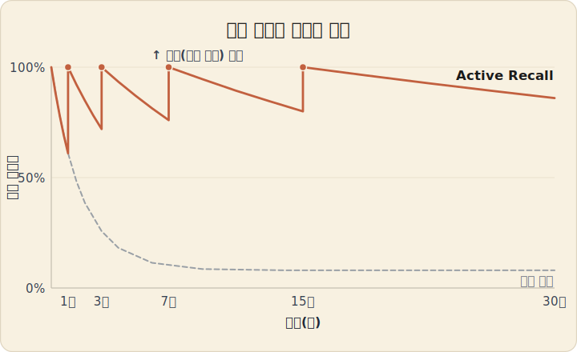
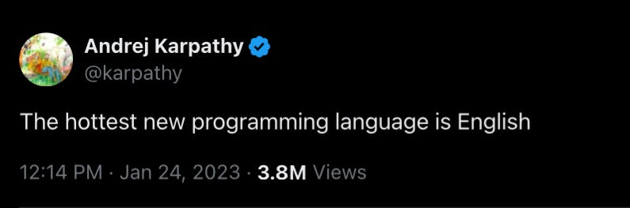
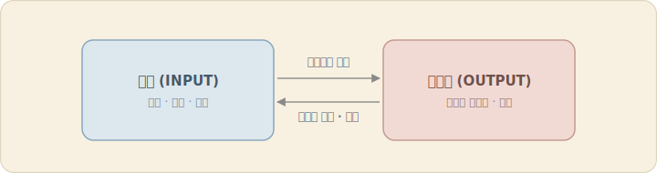

학부생 시절 감명 깊게 보았던 영상 하나가 있는데, 생산성 관련 유튜버 Ali Abdaal의 [
How to Study for Exams - Spaced Repetition | Evidence-based revision tips](https://www.youtube.com/watch?v=Z-zNHHpXoMM)이다. 이 영상에서 말하고자 하는 부분은 명확하다. 진짜 공부와 가짜 공부는 다르며, 진짜 공부란 암기와 복습이다. 

진짜 공부란, 하이라이팅, 노트 그대로 쓰기 같은 수동적 회상(Positive Recall)이 아닌, 방금 배운 개념 책 안보고 요약, 어린아이에게 설명하는 연습, 플래시카드 활용하여 문제 풀기 등 직접적인 뇌에 고통(?)을 가하는 행동을 의미한다. 근육도 상처를 줘야 자라나듯, 뇌도 상처를 입혀야 성장한다고 생각하면 될 것 같다.

능동적 회상이 깊이라면, 간격 반복 학습(Spaced-Repetition)은 빈도이다. 어릴때 부터 선생님과 부모님에게 질리도록 들었던 반복이라는게 사실 과학적 사실에 근거한 주장이었다니. 즉, 쉬운말로 번역하자면, 진짜 공부란 고통을 수반하고, 가짜 공부는 은근슬쩍 나 자신을 속이고 어려운 부분을 넘어가는 행위라고 기억하면 된다.

사실 이러한 내용은 [How to Become a Straight-A Student](https://product.kyobobook.co.kr/detail/S000002848787)이나
[조던 피터슨 | 대학에서 무엇을 배워야 할까?](https://www.youtube.com/watch?v=vbcqu_gVHaU)등 많은 학자들에 의해 이야기가 나오고 있다는 점에서 의미있기도 하다.

## 회사 생활 이후

어느덧 회사에 입사한지도 곧 만 3년이 될 예정이다. 입사 초에는 많은 것을 얻어서 매일 성장하는 주니어 분석가를 꿈꿨지만, 현실은 생각보다 녹록치 않았고(ㅜㅜ), 성장 보다는 생존으로 은글슬쩍 중심이 넘어간 것이 느껴진다. 의미있는 인사이트 전달도 전달이지만, 그전에 당장 실수하면 안되겠다라는 생각이 더 크게 작용하는 생존형 분석가가 되고 있달까.

근데, 그냥 회사에 생존하러 가는 것보다, 이왕 매일 하루도 빠짐없이 해야하는 업무라면 탁월하게 해내고 싶다라는 생각이 들기도하고, 지금 놓아버리면 앞으로 30년간 계속 수동적으로 회사를 다닐 것만 같다는 위기감이 마음속 한켠에서 스멀스멀 올라오고 있다.

문제는, 회사를 다녀보신 분들이라면 아시겠지만, 정신없이 흘러가는 9-to-6의 삶에서 뼈와 살이 되는 경험과 지식을 나의 것으로 체득하고 체화하는 시간과 에너지가 부족하고, 무엇보다 이걸 자산화해서 실제 업무에 적용하거나 이직/구직에 활용하는 프로세스 구축은 더더욱 어렵다는 것이다.

게다가, AI Agent가 기존에는 섵불리 쳐다 보지도 못했던 개발이라는 필드에 발 들이는 것을 도와주면서도, 빨리 따라 잡아야 하는 지식 빚(debt)은 나날이 늘어나는 중이다. 지금 개념을 제대로 공부해야겠다고, 본질을 제대로 이해하고 싶은 욕구가 조금 올라왔다.

|  | 
|:--:| 
| *이제는 언어가 최고의 프로그래밍 언어라는 Andrej Kapathy의 말에 공감이 되는 요즘* |

## 세수하듯 글쓰기

그래서 미루고 미루다가 (사실 미루는 와중에도 마음 한 켠은 불편했지만), 글쓰기를 시작해야겠다고 마음을 먹게 된 것이다. 위에서 말한 진짜 학습의 프레임워크 중 능동적 회상에 가장 좋은 방법 중 하나가 특정 인풋 값을 나만의 아웃풋으로 저장하는 행위, 즉 글쓰기가 거기에 해당한다고 생각해서이다.

특히 내가 강조하고 싶은 부분은 꾸준함이다. 지겹도록 들은 내용이지만, 특히 요즘 열심히 하는 것보다 그냥 꾸준히 하는게 중요하다고 느끼고, 무엇보다 깊이를 경험하고 싶다. 이해하지 못하는 것에 대해서 끝까지 붙들고 결국 체화해서 역량화하고 싶은 욕심이 생긴다.

평소 좋아하는 문구가 있는데, 세수하듯 하라는 것이다. 운동처럼 좋은 줄 알지만 귀찮은 것은 애초에 열심히 할 생각은 하지말고 세수하듯 그냥 하라는 말이다. 그래서 블로깅도, 공부도 그냥 하려고 한다. 절대 열심히 안해야지. 그냥 꾸준하게 조금씩 해야지.